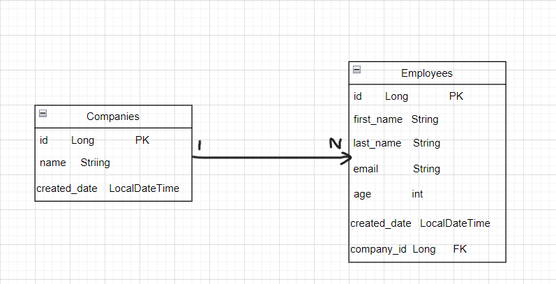

# backend-challenge
## Kullanılan Teknolojiler
* Java 17
* Maven
* Spring Boot (Version : 3.1.5)
* Postqresql
* Dependencies
==> Spring Web
-- Lombok
-- PostgreSQL Driver
-- Spring Data JPA

## Run
- Project > Run As> Maven Build  ``spring-boot:run``
### Company Controller

Method   |   Path   |   Description|Request Parameters|Response Parameters
---------|----------|--------------|----------|----------------
POST     |api/company| Bir Şirketi kaydeder|CreateCompanyDto(Json Body)|CompanyDto(Json Body)
GET      |api/company/{id}|istenen şirketin bilgilerini alır|integer (id)|CompanyDto(Json Body)
GET      |api/company|Bütün şirketlerin listesini alır|----|CompanyDto(Json Body)
GET      |api/company/getByName|Şirket ismi ile şirket bilgilerini alır|name(RequestParam)|CompanyDto(Json Body)
DELETE   |api/company/{id}|Şirket bilgilerini siler|integer (id)| String
PUT      |api/company{id}| Şirket bilgilerini günceller|integer (id) 
 UpdateCompanyDto(Json body)|CompanyDto(Json Body)

### Employee Controller

Method   |   Path   |   Description|Request Parameters|Response Parameters
---------|----------|--------------|----------|--------
POST     |api/employee/{companyId}| Bir çalışanı şirket bilgisi ile beraber kaydeder|integer(companyId) CreateEmployeeDto(Json Body)|EmployeeDto(Json Body)
GET      |api/employee/{id}|İstenen müşterinin bilgilerini alır|integer (id)|EmployeeDto(Json Body)
GET      |api/employee/byCompanyName|Bir şirketteki çalışanları alır|companyName(RequestParam)|EmployeeDto(Json Body)
GET      |api/employee|Tüm çalışanların listesini alır|----|EmployeeDto(Json Body)
DELETE   |api/employee/{id}|Çalışan bilgilerini siler|integer (id)|String
PUT      |api/employee{id}| Çalışan bilgilerini günceller|integer (id) 
 UpdateEmployeeDto(Json body)|EmployeeDto(Json Body)

### Model
- 

- CompanyDto 

  id  Long  

  name String
  
- EmployeeDto 

  name String 

  position String
